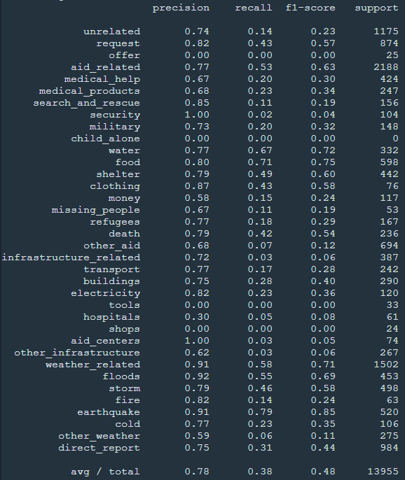

# Disaster Response Classifier

## Table of contents
1. [Introduction](#Introduction)
2. [How to run](#Howtorun)
    1. [Requirements](#Requirements)
    2. [File descriptions](#Filedescriptions)
    3. [Instructions](#Instructions)
3. [Results](#Results)
    1. [Model Accuracy](#ModelAccuracy)
    2. [Classification](#Classification)
4. [Acknowledgement](#Acknowledgement)

<a name="Introduction"></a>
## Introduction

### Objective:
  We would like to categorize real messages that were sent during disaster events so that we can send the messages to an appropriate disaster relief agency.

  origin data:\
  
  <br/>  

### Overview:
  We will read the dataset provided by Appen, clean the data, and then store it in a SQLite database. We will then create a machine learning pipeline that uses NLTK, as well as scikit-learn's Pipeline and GridSearchCV to output a final model to predict classifications for 36 categories (multi-output classifications). Finally, there is a web app included where an emergency worker can input a new message and get classification results in several categories.

<a name="Howtorun"></a>
## How to run

<a name="Requirements"></a>
### 1. Requirements

Python 3\
Libraries: numpy, pandas, sys, sqalchemy, re, NLTK, pickle, Sklearn, plotly and flask libraries

<a name="Filedescriptions"></a>
### 2. File descriptions

<pre>
- app
| - template
| |- master.html            # main page of web app
| |- go.html                # classification result page of web app
|- run.py                   # Flask file that runs app

- data
|- disaster_categories.csv　# data to process
|- disaster_messages.csv  　# data to process
|- process_data.py          # Read, clean, and store data
|- InsertDatabaseName.db    # database to save clean data to

- models
|- train_classifier.py      # machine learning pipeline
|- classifier.pkl  　　　　　# saved model

- image                     # images of the data and results

- README.md
</pre>

<a name="Instructions"></a>
### 3. Instructions

  1.	Data cleaning\
  \
  Run the following command in the root directory of the project.
  ```bat
    'python data/process_data.py data/disaster_messages.csv data/disaster_categories.csv data/DisasterResponse.db'
  ```
  2.	Model training\
  \
  Run the following command in the root directory of the project.
  ```bat
    'python models/train_classifier.py data/DisasterResponse.db models/classifier.pkl'
  ```
  3.	Starting the web app\
  \
  Go to the directory of the app and run the following command.
  ```bat
    'python run.py'
  ```
  4. Go to http://0.0.0.0:3001/

<a name="Results"></a>
## Results

<a name="ModelAccuracy"></a>
### 1. Model Accuracy

presicion: 0.78
\
recall: 0.38
\
f1-score: 0.48
\
  

<a name="Classification"></a>
### 2. Classification

  <br>
  <br>

<a name="Acknowledgement"></a>
### Acknowledgement
Thanks to Appen for the data set and Udacity for the template and training.
